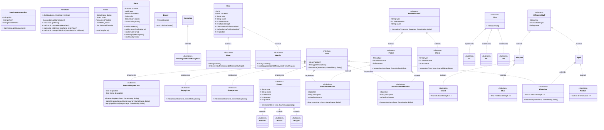

## Diagramme de classes UML

```mermaid
classDiagram
    
    class DatabaseConnection {
        - String URL
        - String USER
        - String PASSWORD
        + Connection getConnection()
    }

    class HeroData {
        + dnd.database.HeroData HeroData
        - Connection getConnection()
        + static void getHero()
        + static void createHero(Hero hero)
        + static void editHero (Hero hero, int idPlayer)
        + static void changeLifePoints (Hero hero, int idPlayer)
    }
    
    class HeroBeyondBoardException {
        <<Exception>>
    }

    class Game {
        - GameDialog dialog
        - Board board
        # int currentPosition
        - int FINAL_CASE
        - Set<Integer> defeatedEnemies
        + void playTurn()
    }

    class Menu {
        - Scanner scanner
        - int idPlayer
        - Hero fictionalHero
        - Color color
        - Color.Colors colors
        - GameDialog dialog
        + void startMenu()
        + void chooseExistingHero()
        + void createHero()
        + void displayHeroSpecs()
        + void modifyHero()
    }

    class Board {
        - ArrayList<Case> cases
        - void initializeCases()
    }
    
    class Hero {
        - int id
        - static int nextId
        # String type
        # String name
        # int healthPoints
        # int attackStrength
        # OffensiveStuff offensiveStuff
        # DefensiveStuff defensiveStuff
        # int position
    }

    class Mage{
        <<Subclass>>
        + String scream()
        + OffensiveStuff learnSpell(OffensiveStuff spell)
    }

    class Warrior{
        <<Subclass>>
        + String scream()
        + void equipWeapon (OffensiveStuff newWeapon)
    }
    
    class Case {
        <<Interface>>
        + int getPosition()
        + String getDescription()
        + interaction(Hero hero, GameDialog dialog)
    }

    class BonusWeaponCase {
        <<Subclass>>
        - final int position
        - final String description
        + interaction(Hero hero, GameDialog dialog)
        - applyWeaponBonus (Warrior warrior, GameDialog dialog)
        - applySpellBonus (Mage mage, GameDialog dialog)
    }

    class EmptyCase {
        <<Subclass>>
        + interaction(Hero hero, GameDialog dialog)
    }

    class EnemyCase {
        <<Subclass>>
        + interaction(Hero hero, GameDialog dialog)
    }
    
class Enemy {
    <<abstract>>
        <<Subclass>>
        # String type
        # String name
        # int lifePoints
        # int damage
        # int position
        + interaction(Hero hero, GameDialog dialog)
    }
    
    class Gobelin {
        <<Subclass>>
    }
    
    class Wizard {
        <<Subclass>>
    }
    
    class Dragon {
        <<Subclass>>
    }
    
    
    class  Potion {
        <<abstract>>
        <<Subclass>>
        - String type
        - int defenseValue
        - String name
        + interaction(Hero hero, GameDialog dialog)
    }
    
    class GreatHealthPotion {
        <<Subclass>>
        - int position
        - String description
        - int healingAmount
        + interaction(Hero hero, GameDialog dialog)
    }

    class StandardHealthPotion {
        <<Subclass>>
        - int position
        - String description
        - int healingAmount
        + interaction(Hero hero, GameDialog dialog)
    }
    
    class OffensiveStuff {
        <<abstract>>
        - String type
        - int attackStrength
        - String name
    }
    
    class DefensiveStuff {
        <<abstract>>
        - String type
        - int defenseValue
        - String name
        + interaction(Character character, GameDialog dialog)
    }
    
class Sword {
        <<Subclass>>
    - final int attackStrength = 5
    }
    
class Club {
        <<Subclass>>
    - final int attackStrength = 3
    }
    
    class Lightning {
        <<Subclass>>
    - final int attackStrength = 2
    + interaction(Hero hero, GameDialog dialog)
    }
    
    class Fireball {
        <<Subclass>>
    - final int defenseValue = 7
    }

    class Shield {
        <<abstract>>
        <<Subclass>>
        - String type
        - int defenseValue 
        - String name
        + interaction(Hero hero, GameDialog dialog)
    }
    class Dice {
        <<Interface>>
        + int throwDice()
    }

    class D1 {
        <<Subclass>>
    }

    class D6 {
        <<Subclass>>
    }

    class D20 {
        <<Subclass>>
    }


    OffensiveStuff <|.. Weapon : extends
    OffensiveStuff <|.. Spell : extends
    
    Weapon <|.. Sword : extends
    Weapon <|.. Club : extends
    Spell <|.. Lightning : extends
    Spell <|.. Fireball : extends

    DefensiveStuff <|.. Potion : extends
    DefensiveStuff <|.. Shield : extends
    Potion <|.. GreatHealthPotion : extends
    Potion <|.. StandardHealthPotion : extends
    
    Case <|.. BonusWeaponCase : implements
    Case <|.. EmptyCase : implements
    Case <|.. EnemyCase : implements
    Case <|.. Enemy : implements
    Case <|.. Lightning : implements
    Case <|.. GreatHealthPotion : implements
    Case <|.. StandardHealthPotion : implements
    
    Hero <|.. Mage : extends
    Hero <|.. Warrior : extends
    
    Enemy <|.. Gobelin : extends
    Enemy <|.. Wizard : extends
    Enemy <|.. Dragon : extends
    

    Dice <|.. D1 : implements
    Dice <|.. D6 : implements
    Dice <|.. D20 : implements
    
    Exception <|-- HeroBeyondBoardException : extends
    
    
```